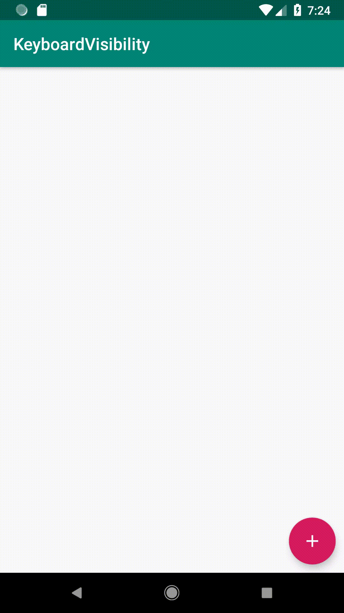

# KeyboardVisibility for Android Kotlin

[  ](https://bintray.com/seachicken/maven/keyboard-visibility/0.1/link)

Handle keyboard visibility event for Android Kotlin.



## Usage

Add `setOnVisibleChangeListener` to Activity.

```kotlin
setOnVisibleChangeListener(object : KeyboardVisibility.VisibleChangeListener {
    override fun onShown() {
        Log.d("KeyboardVisibility", "keyboard is shown")
    }

    override fun onHidden() {
        Log.d("KeyboardVisibility", "keyboard is hidden")
    }
})
```

## Download

```groovy
dependencies {
    implementation 'com.oishiiseachicken.android:keyboardvisibility:0.1'
}
```